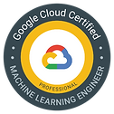
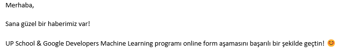
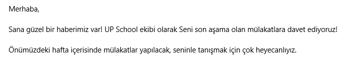
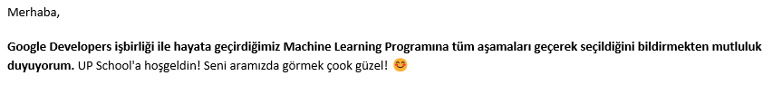

# [Up School & Google Developers Machine Learning Program](https://www.upschool.io/google-ml-program%C4%B1)

This program has been prepared in cooperation with UpSchool and Google Developers.

### What does this program include?

- **12 Hours of Technical Education per week**
  - Prepared by Andrew NG, founder of Coursera and one of the founding members of the Google Brain team and his colleagues online education combining theory and practice in the field of Machine Learning and support lesson sessions with the help of TAs.
  - Live Coding Session by Tuna ÇAKAR

- **1 Hour Self Confidence Training per week**
  - Trainings where we will gain Core Skills; CV preparation, interview preparation trainings

- **Mentor Support**
  - Mentoring from Up School Alumni for 16 Weeks

- **Community Support**
  - Mentoring process that continues after employment
  - Engaging in the UP School Alumni network
  - Providing mentorship support to new students and
  - The right to participate in UP School Graduate training and activities
  
### Google Certificates We'll Get in the Program

|  |  |  |
|-------------------------------------------------------------------------|--------------------------------------------|-------------------------------------------------------------------------|
| GCP Professional ML Engineer Certificate                                | TensorFlow Certificate                     | GCP Professional Data Engineer Certificate                              |

### How will our 1 week be in the program?

Information about completion: ✅(Complete), 🚧 (Work in Progress), ❌ (Incomplete)

- _Monday_: Live Coding Session - 1.5 hour
- _Monday_: Core Skills: 1 hour
- _Wednesday_: Theoretical Foundations - 1.5 hours
- _Thursday_ : Project Meeting - 1 hour
- _The Whole Week_:
  - Online Google Coursera Course - 10 Hours
    - ***Deep Learning Specialization***
      - ✅[01 - Neural Networks and Deep Learning](https://github.com/edaaydinea/UpSchool-Google-Developers-Machine-Learning-Program/tree/main/Deep%20Learning%20Specialization/01%20-%20Neural%20Networks%20-%20Deep%20Learning)
      - ✅[02 - Improving Deep Neural Networks: Hyperparameter Tuning, Regularization and Optimization](https://github.com/edaaydinea/UpSchool-Google-Developers-Machine-Learning-Program/tree/main/Deep%20Learning%20Specialization/02%20-%20Improving%20Deep%20Neural%20Networks%20Hyperparameter%20Tuning%2C%20Regularization%20and%20Optimization)
      - ✅03 - Structuring Machine Learning Projects
      - ✅[04 - Convolutional Neural Networks](https://github.com/edaaydinea/UpSchool-Google-Developers-Machine-Learning-Program/blob/main/Deep%20Learning%20Specialization/04%20-%20Convolutional%20Neural%20Networks)
      - ✅[05 - Sequence Models](https://github.com/edaaydinea/UpSchool-Google-Developers-Machine-Learning-Program/blob/main/Deep%20Learning%20Specialization/05%20-%20Sequential%20Models)
    - ***Professional Certificate in DeepLearning.AI TensorFlow Developer***
      - ✅[01 - Introduction to TensorFlow for Artificial Intelligence, Machine Learning, and Deep Learning](https://github.com/edaaydinea/UpSchool-Google-Developers-Machine-Learning-Program/blob/main/TensorFlow%20Developer%20Professional%20Certificate/01%20-%20Introduction%20to%20TensorFlow%20for%20AI,%20ML%20and%20DL)
      - ✅[02 - Convolutional Neural Networks in TensorFlow](https://github.com/edaaydinea/UpSchool-Google-Developers-Machine-Learning-Program/blob/main/TensorFlow%20Developer%20Professional%20Certificate/02%20-%20CNN%20in%20TensorFlow)
      - ✅[03 - Natural Language Processing in TensorFlow](https://github.com/edaaydinea/UpSchool-Google-Developers-Machine-Learning-Program/blob/main/TensorFlow%20Developer%20Professional%20Certificate/03%20-%20NLP%20in%20TensorFlow)
      - ✅[04 - Sequences, Time Series and Prediction](https://github.com/edaaydinea/UpSchool-Google-Developers-Machine-Learning-Program/blob/main/TensorFlow%20Developer%20Professional%20Certificate/04%20-%20Sequences,%20Time%20Series%20and%20Prediction)

### Optional Homeworks
- ✅[Reduce the overfitting by using data augmentation](https://github.com/edaaydinea/UpSchool-Google-Developers-Machine-Learning-Program/blob/main/Homeworks/1_image_classification_part2.ipynb)
- ✅[Reach at least 98% accuracy against the test set](https://github.com/edaaydinea/UpSchool-Google-Developers-Machine-Learning-Program/blob/main/Homeworks/2_Multi_class_classification_with_MNIST.ipynb)

### Optional Research Projects
- ✅[**01 - Prediction of the Different Progressive Levels of Alzheimer's Disease**](https://github.com/edaaydinea/Prediction-of-the-Different-Progressive-Levels-of-Alzheimer-s-Disease) _(September, 2022)_
- ✅[**02 - Prediction of the Different Progressive Levels of Alzheimer's Disease with MRI data**](https://github.com/edaaydinea/Prediction-of-the-Different-Progressive-Levels-of-Alzheimer-s-Disease-with-MRI-data) _(October, 2022)_

### Capstone Project

- ✅[**Low-Grade Glioma Segmentation**](https://github.com/edaaydinea/Low-Grade-Glioma-Segmentation) _(November 2022 - January, 2023)_
  - Proposal Deadline: October 31, 2022
  - Project Deadline: January 30, 2023
  
### Bootcamp Exams

- ✅**TensorFlow Developer Certification Exam** (December 3- 11, 2022)
  - I passed the exam on December 7,2022.

### Certificates and Badges
| Date             | Certification Name	                                 | Certificates	                                                                                                                                                                                                      | Badges                                                                                                                                                      |
|------------------|-----------------------------------------------------|--------------------------------------------------------------------------------------------------------------------------------------------------------------------------------------------------------------------|-------------------------------------------------------------------------------------------------------------------------------------------------------------|
| November 29,2022 | Deep Learning Specialization                        |                                                        |  |
| December 2, 2022 | DeepLearning.AI TensorFlow Professional Certificate |  |                                                                                                                                                             |
| December 7, 2022 | TensorFlow Certificate Exam                         |                        |                                                                                                                                                             |

### How did I get the right to participate in the training?

- I registered on the dates when the application processes were received. On June 9, 2022, I learned by e-mail that I had successfully passed the online form stage.
 
- Then I took a 40-minute online English test and an 80-minute technical test. The technical test included Python programming and Machine Learning. On July 1, 2022, I learned by this email that I am eligible for interviews.
  
- Then, in the interview (on July 6, 2022), there were 2 different participants besides me and 2 people working within the Up School. In the conversational interview, we talked about our purpose of participation in the program and our future goals.
- On July 8, 2022, I learned by e-mail that I was accepted to the Up School Machine Learning program.
  
- On July 13, 2022, I started the 4.5-month program.
